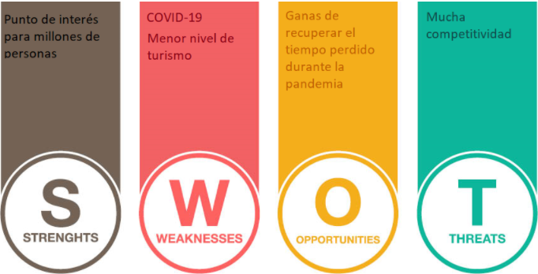
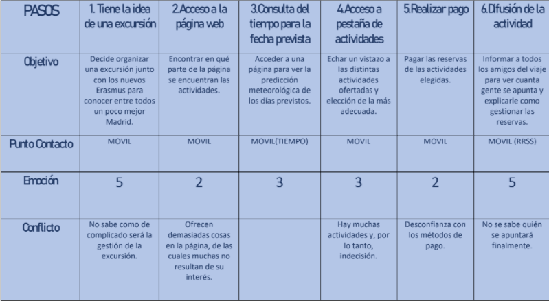
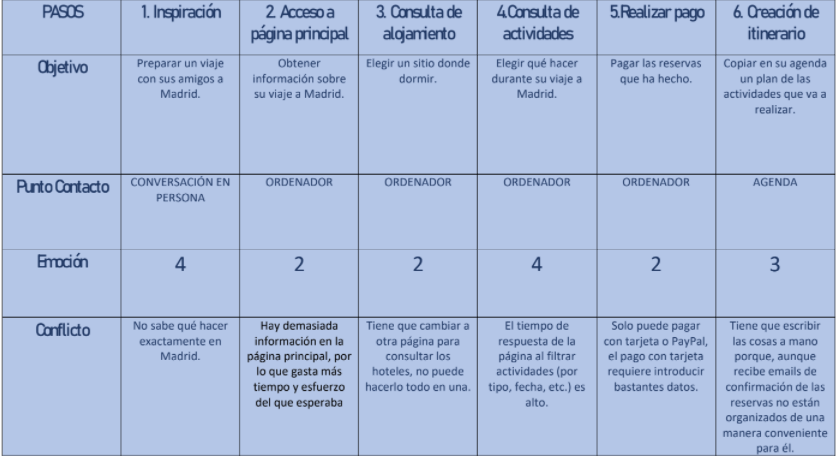
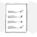

# DIU21
Prácticas Diseño Interfaces de Usuario 2020-21 (Tema: Turismo) 

Grupo: DIU3_Kortatu.  Curso: 2020/21 
Updated: 13/05/2021

Proyecto: Ruta del Jamón

Descripción:Aplicación Web que permitirá a los usuarios realizar realizar visitas turísticas por los pueblos de la alpujarra con un interés gastronómico.

Logotipo: 

Miembros
👤 Carlos Luciano Jimenez Lopez :octocat:
👤 Borja Nicolas Gonzalez Castilla:octocat:

----- 

# Proceso de Diseño 

## Paso 1. UX Desk Research & Analisis 

 1.a Competitive Analysis
-----
Hemos elegido realizar la práctica sobre la página disfrutamadrid.com, de la que se va a realizar un análisis de competitividad.

Como ejemplos de competidores en Madrid existe turismoenmadrid.com, freetour.com o como competición de fuera de Madrid existen granada.city-tour.com y barcelonaturisme.com.

turismoenmadrid.com ofrece esencialmente el mismo producto que disfrutamadrid.com, se puede considerar el competidor más directo.

freetour.com ofrece tours gratuítos por ciudades de todo el mundo pero no alojamiento o algún medio de transporte, obtienen dinero mediante donaciones optativas al final de los tours, también ofrecen tours virtuales ahora durante la época de la pandemia del covid. 

Sobre las tácticas de venta, la excepción es freetour.com, que confía en la opcionalidad del pago para atraer a clientes potenciales, el resto de páginas ofrecen mayor variedad de servicios para poder satisfacer todas las necesidades de un turista pero no se publicitan tan bien.

disfrutamadrid.com es parte de la empresa Civitatis, y tienen presencia en las redes a través del nombre Civitatis, lo que puede ayudar a gente a conocer disfrutamadrid.com si ha usado otro servicio de esta.

barcelonaturisme.com es la página con más presencia en las redes sociales, consiguiendo hasta 343k seguidores en Instagram, Civitatis tiene 143k, y el resto no tienen un seguimiento importante, probablemente porque para el turismo el enfoque más visual de Instagram sea más exitoso porque la gente puede ver fácilmente el sitio al que va.

 1.b Persona
-----
**Persona 1: Sofía Sánchez Vicario**

> “Anteponerse ante las adversidades”

Edad: 25
Ocupación:Estudiante de Máster en Pedagogía.
Familia: Soltera.
Residencia: Valencia.
Motivación: Quiere vivir la vida viajando.
Personalidad (1 al 5)

Introvertido/reservado Vs Extrov/activo
Realista/práctico Vs Intuición/imaginativo
Racional/analitico Vs Emocional/impulsivo
Flemático/apático Vs Colérico/visceral 

Bio
Es de Valencia  y se encuentra en Madrid estudiando un Máster en Pedagogía. Tiene una discapacidad que le imposibilita la modalidad de cintura para abajo. En Madrid tiene un grupo de amigos y tienen como costumbre juntarse con los estudiantes Erasmus que acuden a la ciudad.

Metas 
-Conocer gente nueva.
-Viajar y disfrutar de los diferentes lugares y costumbres.

Frustraciones 
-No poder disfrutar de muchas actividades debido a su discapacidad.

Tecnología (skills)

TIC/Internet -> 4
Movil -> 4
RRSS ->5
Software->3

Contexto (Needs): Quiere demostrarle al mundo que una discapacidad no te impide hacer lo que quieras y vivir una vida plena.

Canales
Publicidad Tradicional -> 1
Online & Social Media -> 4
Recomendaciones & sugerencias -> 3
Persona confianza (amigos, boca a boca) -> 4

**Persona 2:Francisco Fernández Mártinez**

>“tempus fugit“

Edad: 53
Ocupación: Fontanero.
Familia: Divorciado, con dos hijos.
Residencia: Oviedo.
Motivación: Recuperar el tiempo perdido en el matrimonio.
Personalidad (1 al 5)

Introvertido/reservado Vs Extrov/activo 4
Realista/práctico Vs Intuición/imaginativo 2
Racional/analitico Vs Emocional/impulsivo 4
Flemático/apático Vs Colérico/visceral 4

Bio

Francisco es un fontanero de Oviedo que se ha separado, sus dos hijos ya son mayores de edad, su círculo social más habitual son su grupo de amigos con los que suele quedar en bares y que les gusta realizar viajes juntos cada cierto tiempo, para los que disponen de una buena situación económica porque no tiene muchos gastos.

Metas 
Visitar el estadio de su club de fútbol favorito el Real Madrid.
Conocer lugares nuevos con interés histórico-cultural.
Probar comida en lugares diferentes.
Pasar un buen rato con su grupo de amigos.

Frustraciones 
No le gusta cuando las páginas le piden registrarse y poner mucha información que considera que no es necesario dar.

Tecnología (skills)
TIC/Internet 3
Movil 2
RRSS 2
Software 1
Contexto (Needs)
Quiere viajar con sus amigos y desconectar durante sus vacaciones.

Canales
Publicidad Tradicional 4
Online & Social Media 2
Recomendaciones & sugerencias 2
Persona confianza (amigos, boca a boca) 5

 1.c User Journey Map
----

>>> Comenta brevemente porqué has escogido estas dos experiencias de usuario (y si consideras que son habituales) (80-150 caracteres) 

 1.d Usability Review
----
>>>  Revisión de usabilidad: (toma los siguientes documentos de referncia y verifica puntos de verificación de  usabilidad
>>>> SE deben incluir claramente los siguientes elementos
>>> - Enlace al documento:  (sube a github el xls/pdf) 
>>> - Valoración final (numérica): 
>>> - Comentario sobre la valoración:  (60-120 caracteres)

## Paso 2. UX Design  

 2.a Feedback Capture Grid / EMpathy map / POV
----

>>> Comenta con un diagrama los aspectos más destacados a modo de conclusion de la práctica anterior,

 Interesante | Críticas     
| ------------- | -------
  Preguntas | Nuevas ideas
  
    
>>> ¿Que planteas como "propuesta de valor" para un nuevo diseño de aplicación para economia colaborativa ?
>>> Problema e hipótesis
>>>  Que planteas como "propuesta de valor" para un nuevo diseño de aplicación para economia colaborativa te
>>> (150-200 caracteres)

 2.b ScopeCanvas
----
>>> Propuesta de valor 

 2.b Tasks analysis 
-----

>>> Definir "User Map" y "Task Flow" ... 

 2.c IA: Sitemap + Labelling 
----

>>> Identificar términos para diálogo con usuario  

Término | Significado     
| ------------- | -------
  Login¿?  | acceder a plataforma

 2.d Wireframes
-----

>>> Plantear el  diseño del layout para Web/movil (organización y simulación ) 

## Paso 3. Mi UX-Case Study (diseño)

 3.a Moodboard
-----

Se ha creado un moodboard con Milanote y un logotipo, que se pueden ver en este enlace: https://app.milanote.com/1Lzdtv1v5hAX6S?p=4vGcJtbWbKB

El logotipo se ha creado con GIMP basandonos en un logotipo de Sierra Nevada, la resolución de 910x548 pixeles se debe a la resolución del logotipo original de Sierra Nevada que se ha modificado, nos gustaría de disponer del logotipo con mayor resolución pero creemos que 910x548 es suficiente resolución para la mayoría de usso del logotipo.

  3.b Landing Page
----

Se ha diseñado una landing page usando Adobe xd, que está disponible con el nombre Ruta del Jamón Landing Page.xd en la carpeta p3.

 

 3.c Guidelines
----
Patrones de diseño usados en el diseño de La Ruta del Jamón.

Input Promt: Para introducir datos en reserva.

Rate Content: En página de experiencias con reseñas de TripAdvisor.

Calender Picker: En tours, tour 1 y pack de tours para comprobar la disponibilidad de los tours.

Vertical Dropdown Menu: En todas las páginas para moverse de página.

Home Link: En todas las páginas para moverse al inicio.

Fat Footer: En todas las páginas existe un footer con información que puede importar al usuario.

Frequently Asked Questions (FAQ): Existe una sección de preguntas frecuentes.

Gallery: Existe una galería de imágenes en la página principal, representada por dos flechas para cambiar de imagen.

Optimism Bias: Se ha intentado usar un lenguaje positivo respecto al producto que se quiere vender.

  3.d Mockup
----

Se ha realizado un mockup con Adobe xd, el archivo está disponible en la carpeta p3 cone el nombre Ruta del Jamon.xd

 3.e ¿My UX-Case Study?
-----

En este enlace podemos ver un video con una breve descripción de nuestro proyecto:https://youtu.be/iec6DRej5wo

## Paso 4. Evaluación 

 4.a Caso asignado
----

>>> Breve descripción del caso asignado con enlace a  su repositorio Github

 4.b User Testing
----

>>> Seleccione 4 personas ficticias. Exprese las ideas de posibles situaciones conflictivas de esa persona en las propuestas evaluadas. Asigne dos a Caso A y 2 al caso B
 

| Usuarios | Sexo/Edad     | Ocupación   |  Exp.TIC    | Personalidad | Plataforma | TestA/B
| ------------- | -------- | ----------- | ----------- | -----------  | ---------- | ----
| User1's name  | H / 18   | Estudiante  | Media       | Introvertido | Web.       | A 
| User2's name  | H / 18   | Estudiante  | Media       | Timido       | Web        | A 
| User3's name  | M / 35   | Abogado     | Baja        | Emocional    | móvil      | B 
| User4's name  | H / 18   | Estudiante  | Media       | Racional     | Web        | B 

. 4.c Cuestionario SUS
----

>>> Usaremos el **Cuestionario SUS** para valorar la satisfacción de cada usuario con el diseño (A/B) realizado. Para ello usamos la [hoja de cálculo](https://github.com/mgea/DIU19/blob/master/Cuestionario%20SUS%20DIU.xlsx) para calcular resultados sigiendo las pautas para usar la escala SUS e interpretar los resultados
http://usabilitygeek.com/how-to-use-the-system-usability-scale-sus-to-evaluate-the-usability-of-your-website/)
Para más información, consultar aquí sobre la [metodología SUS](https://cui.unige.ch/isi/icle-wiki/_media/ipm:test-suschapt.pdf)

>>> Adjuntar captura de imagen con los resultados + Valoración personal 

 4.d Usability Report
----

>> Añadir report de usabilidad para práctica B (la de los compañeros)

>>> Valoración personal 

## Paso 5. Evaluación de Accesibilidad  

  5.a Accesibility evaluation Report 
----

>>> Indica qué pretendes evaluar (de accesibilidad) sobre qué APP y qué resultados has obtenido 

>>> 5.a) Evaluación de la Accesibilidad (con simuladores o verificación de WACG) 
>>> 5.b) Uso de simuladores de accesibilidad 

>>> (uso de tabla de datos, indicar herramientas usadas) 

>>> 5.c Breve resumen del estudio de accesibilidad (de práctica 1) y puntos fuertes y de mejora de los criterios de accesibilidad de tu diseño propuesto en Práctica 4.

## Conclusión final / Valoración de las prácticas

>>> (90-150 palabras) Opinión del proceso de desarrollo de diseño siguiendo metodología UX y valoración (positiva /negativa) de los resultados obtenidos  

